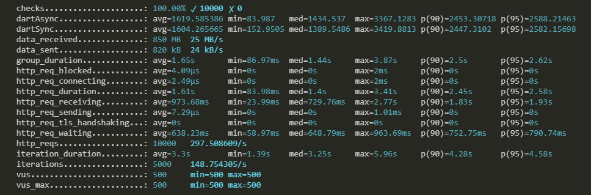
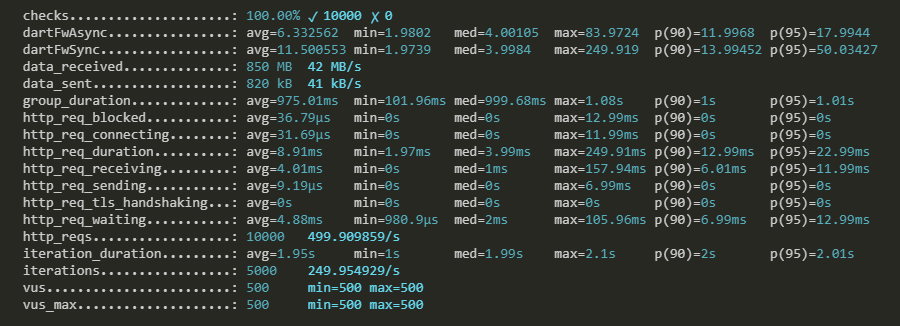
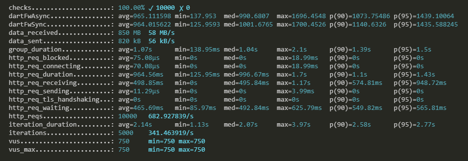
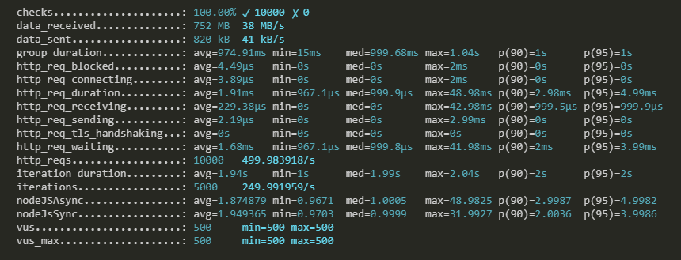
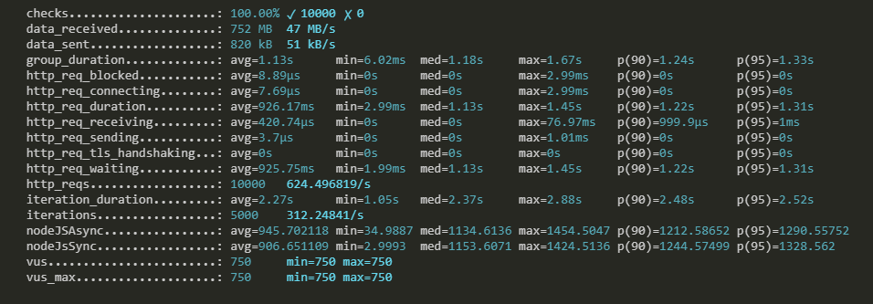
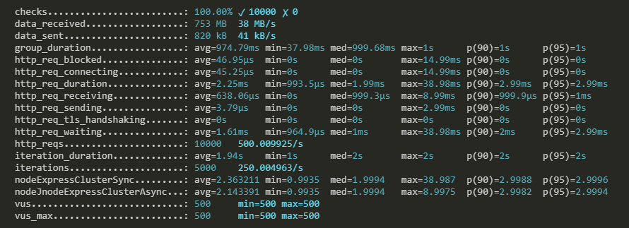
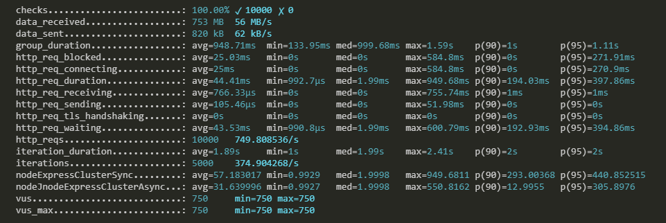

# Dart vs Node.js

### Load test with K6io

- execute for all groups grouped by service `k6 run .\k6io\testAll.js --vus 500 --rps 500 --iterations 5000`

## Native Dart

### 500 rps

### 750 rps

- http_reqs: 309.10154/s

## Aqueduct framework for Dart

### 500 rps

### 750 rps

## Native Node.js

### 500 rps

### 750 rps

## Node Express with Cluster

### 500 rps

### 750 rps

## Loadtest.js

### test for http servers dart, aqueduct (dart framework), node.js with loadtest.js

### results

- 1 GET, create 1000 humans and response to client (synchronous handlers)
  - concurency: 500,
  - maxSeconds: 60

| name          | dart  | dart (fm) | node  |
| ------------- | ----- | --------- | ----- |
| totalRequests | 14056 | 14514     | 20510 |
| rps           | 234   | 242       | 342   |
| meanLatencyMs | 4.2   | 4.1       | 2.9   |
| maxLatencyMs  | 114   | 103       | 16    |
| meanLatencyMs | 3     | 3         | 2     |

- 2 GET, create 1000 humans and response to client (asynchronous handlers)
  - concurency: 500,
  - maxSeconds: 60

| name          | dart  | dart (fm) | node  |
| ------------- | ----- | --------- | ----- |
| totalRequests | 10922 | 15069     | 21400 |
| rps           | 182   | 251       | 357   |
| meanLatencyMs | 5.5   | 4         | 2.8   |
| maxLatencyMs  | 18    | 16        | 14    |
| meanLatencyMs | 4     | 3         | 2     |
